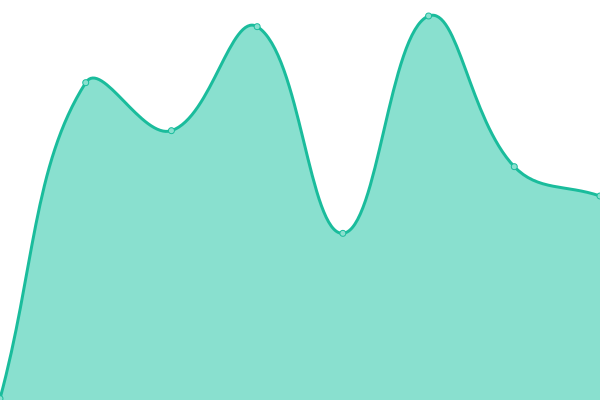

# [📈 Live Status](https://upptime.github.io/upptime): <!--live status--> **🟩 All systems operational**

This repository contains the open-source uptime monitor and status page for [Upptime](https://upptime.js.org), powered by [Upptime](https://github.com/upptime/upptime).

With [Upptime](https://upptime.js.org), you can get your own unlimited and free uptime monitor and status page, powered entirely by a GitHub repository. We use [Issues](https://github.com/upptime/upptime/issues) as incident reports, [Actions](https://github.com/relotnek/asgarduptime/actions) as uptime monitors, and [Pages](https://upptime.github.io/upptime) for the status page.

<!--start: status pages-->
<!-- This summary is generated by Upptime (https://github.com/upptime/upptime) -->
<!-- Do not edit this manually, your changes will be overwritten -->
<!-- prettier-ignore -->
| URL | Status | History | Response Time | Uptime |
| --- | ------ | ------- | ------------- | ------ |
|  [Asgard Security](https://www.asgardsec.com) | 🟩 Up | [asgard-security.yml](https://github.com/relotnek/asgarduptime/commits/HEAD/history/asgard-security.yml) | 

 140ms
     
 | 

<a href="https://relotnek.github.io/asgarduptime/history/asgard-security">100.00%</a>
    

|  [R2DSO](https://www.r2dso.com) | 🟩 Up | [r2-dso.yml](https://github.com/relotnek/asgarduptime/commits/HEAD/history/r2-dso.yml) | 

 327ms
     
 | 

<a href="https://relotnek.github.io/asgarduptime/history/r2-dso">100.00%</a>
    

|  [Does Simon Need a Break?](http://doessimonneedabreak.com) | 🟩 Up | [does-simon-need-a-break.yml](https://github.com/relotnek/asgarduptime/commits/HEAD/history/does-simon-need-a-break.yml) | 

 201ms
     
 | 

<a href="https://relotnek.github.io/asgarduptime/history/does-simon-need-a-break">100.00%</a>
    

|  [Filecoin Proofs](https://proofs.filecoin.io) | 🟩 Up | [filecoin-proofs.yml](https://github.com/relotnek/asgarduptime/commits/HEAD/history/filecoin-proofs.yml) | 

 200ms
     
 | 

<a href="https://relotnek.github.io/asgarduptime/history/filecoin-proofs">98.40%</a>
    

|  [Filecoin Security](https://security.filecoin.io) | 🟩 Up | [filecoin-security.yml](https://github.com/relotnek/asgarduptime/commits/HEAD/history/filecoin-security.yml) | 

 332ms
     
 | 

<a href="https://relotnek.github.io/asgarduptime/history/filecoin-security">99.65%</a>
    

<!--end: status pages-->

[**Visit our status website →**](https://relotnek.github.io/asgarduptime)

## 📄 License

- Powered by: [Upptime](https://github.com/upptime/upptime)
- Code: [MIT](./LICENSE) © [Anand Chowdhary](https://anandchowdhary.com), supported by [Pabio](https://pabio.com)
- Data in the `./history` directory: [Open Database License](https://opendatacommons.org/licenses/odbl/1-0/)
